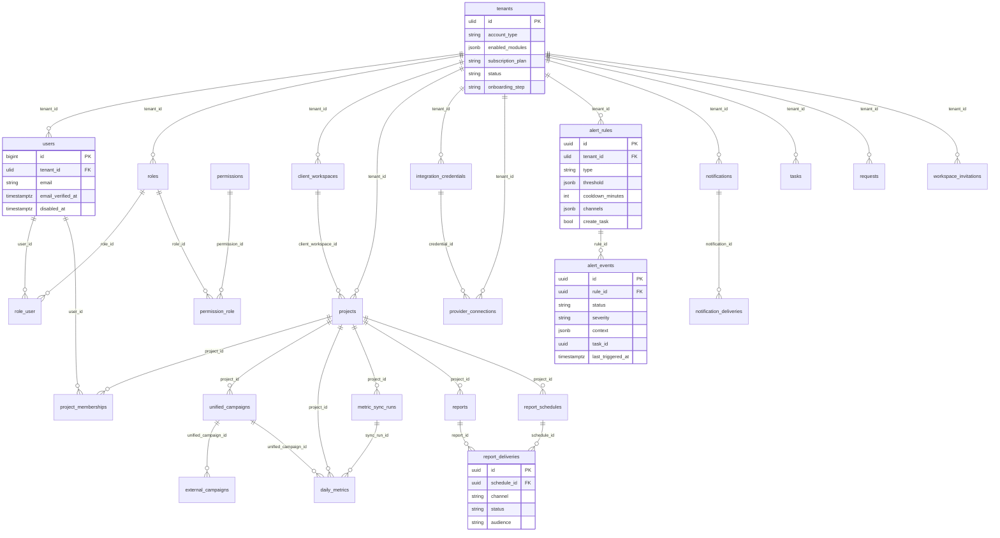

# Database ERD — CampaignsHub (core domain)

PostgreSQL, 74 tables. Everything is tenant-scoped: `tenant_id` on domain tables is enforced fail-closed by a
global scope. Below are the core entities and their real relationships (support/pivot/audit tables omitted for
readability).

Notes:
- `status`/`disabled_at` on `users` drive suspended-account enforcement (`EnsureAccountActive`).
- Delivery tables (`report_deliveries`, `notification_deliveries`) carry an honest status: never `sent` without
  a real provider acknowledgement (defaults `awaiting_provider_credentials` / `awaiting_credentials`).
- `alert_events` is the firing ledger (cooldown/dedup/snooze/resolve); `alert_rules` is the config.
